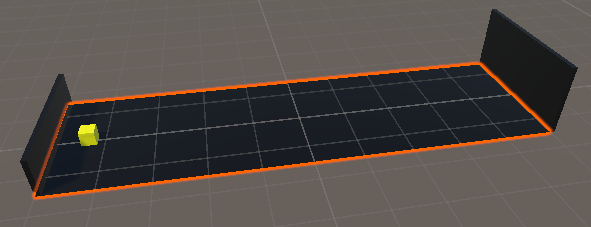
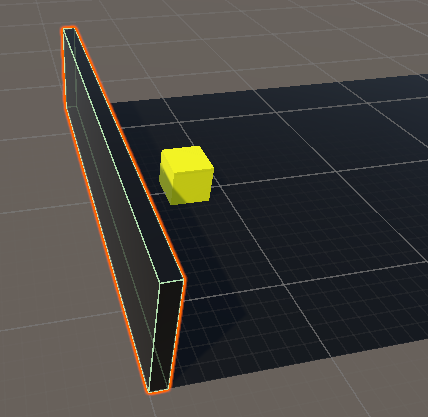
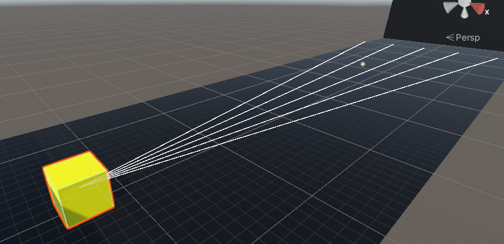
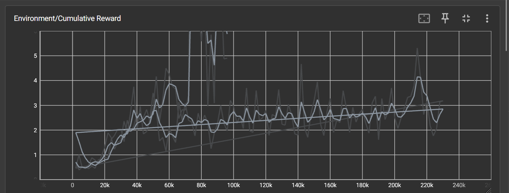
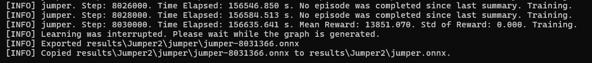
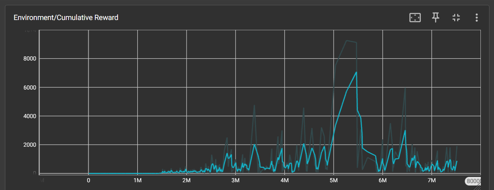

# ML Agents deel 3 - Jumper Opdracht

## Documentatie

Om de opdracht te starten heb ik eerst een training area gebouwd, die bestaat uit 4 verschillende dingen.

### training area vloer


Dit is gewoon de "grond" waarop de agent zal staan en is gewoon een plane.

### danger wall spawner


Dit is een gameobject dat op bepaalde intervallen DangerWall prefabs spawnt in het level waar de agent zal moeten over springen. Dit gebeurt door volgend script:

```cs
using System.Collections;
using System.Collections.Generic;
using UnityEngine;

public class SpawnWalls : MonoBehaviour
{
    public GameObject objectToSpawn;
    public float minSpawnIntervalMilliseconds = 3500f;
    public float maxSpawnIntervalMilliseconds = 5000f;
    private float timeUntilNextSpawn;

    void Start()
    {
        timeUntilNextSpawn = Random.Range(minSpawnIntervalMilliseconds, maxSpawnIntervalMilliseconds);
    }

    void Update()
    {
        timeUntilNextSpawn -= Time.deltaTime * 1000;

        if (timeUntilNextSpawn <= 0f)
        {
            SpawnObject();
            timeUntilNextSpawn = Random.Range(minSpawnIntervalMilliseconds, maxSpawnIntervalMilliseconds);
        }
    }

    private void SpawnObject()
    {
        Vector3 spawnerPosition = transform.position;
        Instantiate(objectToSpawn, new Vector3(spawnerPosition.x, 2.5f, spawnerPosition.z), Quaternion.identity);
    }
}
```

### back wall


Dit is de muur achter de agent. Als de agent succesvol over een muur is gesprongen zal dit gameobject er voor zorgen dat de agent punten krijgt. De backwall zal er ook voor zorgen dat muren waar de agent al is voer gesprongen verwijderd worden uit de game. Dit alles door volgende code op de wall prefabs (dus niet op de backwall zelf):

```cs
using System.Collections;
using System.Collections.Generic;
using UnityEngine;

public class WallMovement : MonoBehaviour
{
    public float speed = 20.0f;
    private GameManager gameManager;
    void Start()
    {
        gameManager = FindObjectOfType<GameManager>();
    }

    void Update()
    {
        transform.Translate(Vector3.back * speed * Time.deltaTime);
    }

    void OnTriggerEnter(Collider other)
    {
        if (other.CompareTag("BackWall"))
        {
            gameManager.NotifyWallDestroyed();
            Destroy(gameObject);
        }
    }
}
```

### agent


Dit is het belangrijkste gameobject van het project. De agent zal worden getrained om over de muren te springen die naar de agent toe bewegen. De agent kan "zien" door zijn eigen hoogte te weten en door ray perception sensors zoals te zien is op bovenstaande afbeelding. De agent wordt een klein beetje afgestraft wanneer hij springt (om er voor te proberen zorgen dat hij niet de hele tijd springt) en een grote beloning wanneer een muur de back wall raakt en de agent er dus over gesprongen is. Dit door volgend script:

```cs
using System.Collections;
using System.Collections.Generic;
using Unity.MLAgents;
using Unity.MLAgents.Sensors;
using Unity.MLAgents.Actuators;
using UnityEngine;

public class AgentScript : Agent
{
Rigidbody rb;
public float jumpForce = 100f;
private GameManager gameManager;
private bool isGrounded = true;

    public void Start()
    {
        gameManager = FindObjectOfType<GameManager>();
        rb = GetComponent<Rigidbody>();
        rb.freezeRotation = true;
    }
    public override void OnEpisodeBegin()
    {
        this.transform.localPosition = new Vector3(0.0f, 1.5f, -43.0f);
        this.transform.localRotation = Quaternion.identity;
        rb.freezeRotation = true;
        isGrounded = true;
    }

    public override void CollectObservations(VectorSensor sensor)
    {
        sensor.AddObservation(transform.localPosition.y);
    }

    public override void OnActionReceived(ActionBuffers actionBuffers)
    {
        var actions = actionBuffers.ContinuousActions;
        if (isGrounded && actions[0] > 0)
        {
            AddReward(-0.01f);
            Jump();
        }
    }

    public override void Heuristic(in ActionBuffers actionsOut)
    {
        var continuousActionsOut = actionsOut.ContinuousActions;
        continuousActionsOut.Clear();
        if (Input.GetKey(KeyCode.Space))
        {
            continuousActionsOut[0] = 1;
        }
        else
        {
            continuousActionsOut[0] = 0;
        }
    }
    public void WallDestroyed()
    {
        AddReward(1.0f);
    }

    private void OnCollisionEnter(Collision collision)
    {
        rb.freezeRotation = true;
        if(!collision.gameObject.CompareTag("Floor"))
        {
            gameManager.ResetWalls();
            EndEpisode();
        }
        if(collision.gameObject.CompareTag("Floor"))
        {
            isGrounded = true;
        }
    }

    private void Jump()
    {
        rb.AddForce(Vector3.up * jumpForce, ForceMode.Impulse);
        isGrounded = false;
    }

}

```

### gamemanager

De gamemanager is het gameobject dat de functionaliteit van de andere gameobjecten waar nodig aan elkaar verbindt (zoals in bovenstaande code te zien is), door volgend script:

```cs
using System.Collections;
using System.Collections.Generic;
using UnityEngine;

public class GameManager : MonoBehaviour
{
    public void NotifyWallDestroyed()
    {
        FindObjectOfType<AgentScript>().WallDestroyed();
    }
    public void ResetWalls()
    {
        GameObject[] walls = GameObject.FindGameObjectsWithTag("DangerWall");
        foreach (GameObject wall in walls)
        {
            Destroy(wall);
        }
    }
}
```

## Training

Ik heb de training meerdere keren moeten doen, omdat er bij de eerste dingen nog wat configuratie fouten waren die ik later heb moeten oplossen voor training 2.

### training 1

Deze training heeft niet zo lang geduurd (rond de 2 uur). Training 1 verliep in het begin traag, en de agent leerde niet snel wat nu eigelijk de bedoeling was. Dit veranderde snel na even trainen toen de agent doorhad dat ik de Jump() functie niet zo goed had geïmplementeerd. Hier moest de agent niet de grond raken om nog eens te kunnen springen. De agent maakte hier lustig gebruik van en vloog gewoon omhoog om alle muren onder zich heen te laten gaan om "oneindig" veel punten te verdienen.


### training 2

Voor training 2 startte heb ik eerst het sprong probleem opgelost door eerst te controleren of de agent de grond geraakt had voor deze terug kon springen.
Deze training heb ik veel langer laten duren (ongeveer 43,5 uur en ongeveer 8.030.000). Dit was niet de volledige 15000000 steps uit de config file, maar de agent was duidelijk al zeer goed in het springen over de muren. Ook in training 2 was het in het begin duidelijk dat de agent niet veel vooruitgang boekte, maar na ongeveer 1.400.000 steps begon de agent vooruitgang te boeken. Hierna werd de agent gestaag beter. De agent werdt wanneer hij zeer ver in de training was zeker beter, maar het was wel raar om te zien hoe de agent een paar keer maar een "laag aantal punten" haalde en dan plots uitschieters had. Ik heb de training gestopt toen de agent een uitschieter van boven de 13.000 behaalde.


